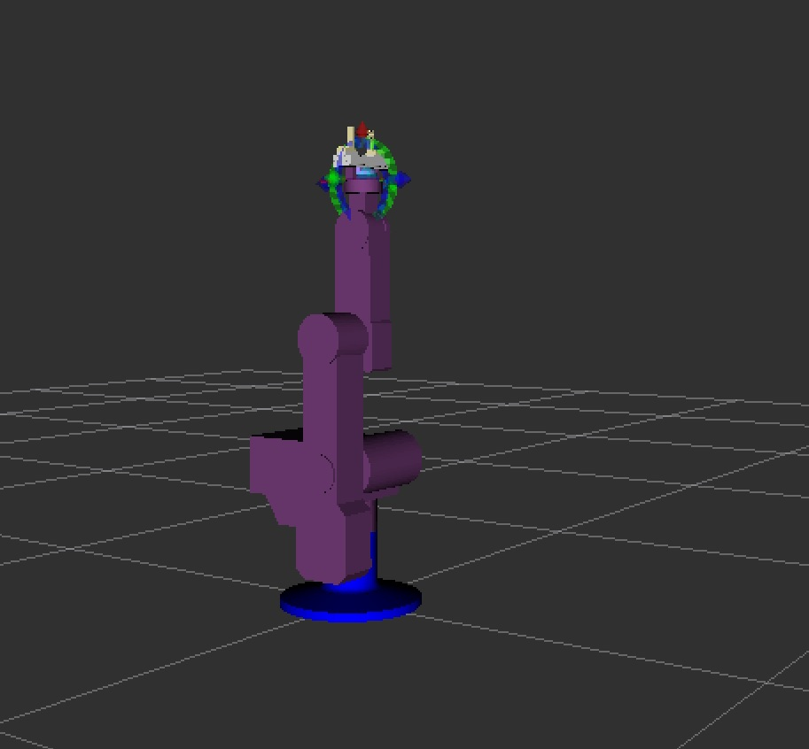

# STX-Controller: ER9 

### ***Technical properties***

 System requirements:
   
   * Ubuntu 16.04. 
   
   * ROS - kinetic.
   
   * Moveit!. 
   
   * Kinematic solver: Track-IK.

## **Introduction**

 The STX-Controller will allow us to move and communicate with our robots 
 by writing (or editing) the 'moveit_node' or by moving the robot in the 'Rviz' simulation.
 
 The communication is throw a TCP-Telnet/UDP protocols, in which the MC is the server and 
 the other nodes: 'arm_controller', 'stx_joint_state_publisher' and 
 'moveit_node' are on the client side.

## **Installation and Setup**
  
 In order of working with our system we need to install ROS - Kinetic, MoveIt! and TRAC-IK Kinematics Solver.
 
 - ROS - Kinetic installation : http://wiki.ros.org/kinetic/Installation/Ubuntu
 - Moveit! installation : https://moveit.ros.org/install/
 - TRAC-IK Kinematics Solver installation : http://docs.ros.org/kinetic/api/moveit_tutorials/html/doc/trac_ik/trac_ik_tutorial.html
 
 After installing the above create a new folder for the project.
 
 Clone the repository to the folder by executing the following command:
 
     git clone https://github.com/servotronix/stxros.git
 
 Next Enter 'stxros' folder, open the terminal and execute:
    
     catkin_make
  
 Find the '.bashrc' file in your computer. (it is a hidden file in your 'home' directory, use 'ctl + h' to see hidden files)
 
 In the '.bashrc' file add the following line:
 
    source <path to setup.bash>
 
 _'path to setup.bash' is the absolute path to the 'setup.bash' file which located under 'devel' folder in your project._
 
 
 
## **Starting the system**

  _If you haven’t already done so, make sure you’ve completed the steps in 'Installation and Setup'._

 In order to start the robot movement you need to execute the following in your terminal window:
 
 - Make sure to be in the workspace directory. ('stxros')

 - Staring the ROS system with the 'er9' robot connected:
 
        roslaunch stx_control run_er9.launch mc_ip:=132.68.161.26

Where 132.68.161.26 is the IP of the mc. There is also an option to change the default value of mc\_ip in src/stx_control/launch/run_er9.launch in which case you do not need to enter a value externally
 
 - In case a robot is not connected we provide a 'simulation' mod which can be started by executing:
 
        roslaunch stx_control simulation.launch
      
  
  **The system is up and ready to take commands!**
   
 
 ## **Operating the system**
 
 
   In order to plan a new robot movement the 'moveit node' needs to be edited.
   
   - Adding the 'Moveit!' controller node to our system (from a new terminal window):

         rosrun stx_control moveit_node.py
   
   The 'moveit_node.py' node shows basic robot movement which can be executed by pressing the 
   keys instructed on the 'moveit_node.py' terminal consul window.
   
-   **The node could be edited or replaced in order to move the robot in different ways.**
   
   
   
 ## **Homing procedure**
 
If the robot has been turn off during movement execution or suffered from a different kind of unexpected
error and now is not compatible with the 'Rviz' simulation we wil need to do manual 'Homing'.

The Homing position of the robot is illustrated in the following image

There are two ways to home the robot arm. 

 #### First option

 - Move the robot manually to the home position
 - Execute in a new terminal window the command (make sure to be in 'stxros' directory):

        python src/stx_control/scripts/er9_zeroing.py --mc_ip=132.68.161.26
 #### Second option

 - Execute in a new terminal window the command (make sure to be in 'stxros' directory):
 
        python src/stx_control/scripts/er9_gui_homing.py --mc_ip=132.68.161.26
or for the non-gui version:

        python src/stx_control/scripts/er9_cmd_homing.py --mc_ip=132.68.161.26
  
  When the controller appears you will need to move each joint to the 'Home' position and after press 'Set joint!.
 
 Once all the joints are set we can quit the homing controller and start planing.

  

    
  #### _**Additional control tips:**_
- _Speed and IP setup:_

    Robot maximum movement speed and the MC-IP address are scalable and easy to change by editing the 'run_er9.launch' file.
    
     - To change robot maximum speed edit the 'value' which is followed by the 'ROBOT-SPEED' parameter. (default is 15)
    
    -  To change MC IP edit the 'default' which is followed by the 'MC-IP' parameter. (default is 90.0.0.1)
    
- _Gripper control:_

   In order to control gripper from 'Rviz', go to 'Planing Request' and
 change the planing group label to 'gripper'. 
 
   Under 'Planing' label set the 'Select goal state' to be the wanted gripper position.
   After, press the 'Update' button and you are ready to execute the command with 'Plan and Execute'
   button.
 
 
- _Exit the system:_

    press 'Ctrl + c' on terminal window.

